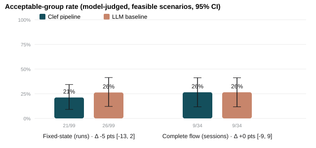
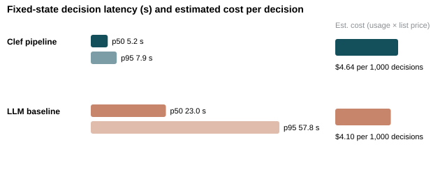

# Group Taste-Match: Clef pipeline vs. simple LLM baseline

**Results report · October 2026 · independent concept prototype (not an official Beli integration)**

> **Recommendation (provisional): ship the simple LLM baseline, and fix its latency before any user test.** On 40 held-out group scenarios, the automated quality measures found **no meaningful difference**: 26% vs 21% acceptable-group rate in the fixed-state comparison (Clef − baseline −5 points, 95% CI −13 to +2) and an exact tie of 26% in the complete flow (CI −9 to +9). Both methods were equally safe: **zero** hard-constraint violations and **27/27** correct "no match" answers. The deciding evidence was a blinded A/B review of the 23 scenarios where the two methods picked different restaurants. The reviewer preferred the baseline **15 times and Clef 5 times**, with 1 tie and 2 "neither acceptable": 75% of decided cases (95% CI 53–89%). The main reason was that Clef's picks often ignored the cuisine people asked for. The tradeoff is speed: Clef decides in **5.2 s median (7.9 s p95)** versus **23 s (58 s)** for the baseline. Neither meets the 15-second p95 target in the complete flow. Cost is about the same, roughly half a cent per decision. The recommendation is provisional because the only human reviewer is also the developer, the scenarios are synthetic, and quality scores are model-judged.

## What was tested

A host creates a room, 2–6 diners say what they want, and the system returns **one** restaurant from a curated list of 30 real NYC restaurants, with dated, field-level evidence. It may ask one private clarification per affected diner and one final soft-priority question to the host. Two interchangeable decision methods were compared. Everything else was shared.

| | Clef pipeline | Simple LLM baseline |
| --- | --- | --- |
| Who picks | Clef (`@cf/cloudflare/clef`) scores every diner × eligible restaurant on a 0–4 rubric, batched ≤64 questions per call. Code picks the restaurant with the best **weakest-diner** fit (shortlist within 0.15, then mean fit, then shortest worst trip, then id). | One `gpt-oss-120b` prompt per stage, given the same priorities, fairness rule, tie rules and stage limits, picks the restaurant or the next action. |
| Clarify / host | Code finds ambiguities whose readings change the feasible set; Clef picks the most consequential topic; the LLM writes the question. The host is asked only if the choice is weak or uneven **and** the answer would change it. | The same prompt decides whether to clarify (only from the diner's own ambiguities) or ask the host. |
| Wording | The LLM writes the explanation from anonymized group needs. | The same prompt writes it. |

**Shared by both, so the comparison is fair:**
- **Interpretation:** `gpt-oss-120b`, plus deterministic grounding, backstop and budget-basis safeguards.
- **Data:** the restaurant snapshot, synthetic profiles, travel estimates and simulated availability.
- **Hard-constraint guard:** checks hours, availability, budget basis, dietary evidence and travel limits, before selection and again before delivery.
- **Output and stage handling:** the privacy filter, the result card, and the room state machine.

There was one schema-repair attempt and one guard recovery per method, and no fallback between methods.

**Design.**
- **Scenarios:** 60 synthetic scenarios across 10 families, 20 for development and 40 held out, with group sizes 2–6 balanced exactly. Requirements and truthful clarification answers were prelabeled before any runs.
- **Freeze:** prompts, safeguards and thresholds were tuned only on development scenarios, then frozen (`experiment/protocol.json`, commit `6470ba2`).
- **Fixed-state track:** 240 runs, 3 permuted repeats per method of the 40 held-out scenarios on identical frozen inputs, with clarification and host questions off.
- **Complete-flow track:** 80 sessions, one per method per scenario, with a simulator that answers only from prewritten facts.
- **Constraint checking:** deterministic, against ground truth.
- **Fit scoring:** blinded per-diner 0–4 scores from a separately configured judge model (`kimi-k2.6`), labeled **model-judged**.

## Scorecard (held-out, 40 scenarios)

| Metric | Clef | Baseline | Notes |
| --- | --- | --- | --- |
| Acceptable-group rate, fixed-state | 21/99 (21%) | 26/99 (26%) | Feasible runs; every diner model-judged ≥2/4; failures count. Δ −5 pts [−13, +2]. |
| Acceptable-group rate, complete flow | 9/34 (26%) | 9/34 (26%) | Δ 0 pts [−9, +9]. |
| Weakest-diner fit (0–4), fixed / flow | 0.76 / 0.91 | 0.91 / 0.88 | Failures score 0. |
| Delivered hard violations | 0/160 | 0/160 | Raw proposals: also 0 for both; the guard never had to block. |
| Correct "no match" (infeasible) | 21/21 · 6/6 | 21/21 · 6/6 | Fixed · flow. |
| False "no match" (feasible) | 0/133 | 1/133 | Baseline, flow S03. |
| Valid outcomes | 157/160 | 160/160 | All 3 Clef failures were Clef calls exceeding the 30 s timeout. |
| Decision latency p50 / p95, fixed | 5.2 s / 7.9 s | 23.0 s / 57.8 s | |
| Stage latency p50 / p95, flow | 10.7 s / 21.3 s | 36.1 s / 92.5 s | Includes shared interpretation. Target p95 ≤15 s: **not met by either.** |
| Questions per diner, flow | 2/160 | 1/160 | All 3 questions were about topics with no prewritten fact (no answer). |
| Host final-call rate, flow | 8/40 (20%) | 0/40 | |
| Privacy leaks caught by the filter | 1 | 24 | Replaced with a neutral template before display. |
| Same pick across permuted repeats | 66% | 87% | |
| Est. cost per decision / per session | $0.0046 / $0.0083 | $0.0041 / $0.0071 | Token usage × dated list prices. |
| Human A/B, differing picks (23) | 5 wins | 15 wins | 1 tie, 2 neither. One reviewer, who is also the developer. |

## How we decided

The selection rule was written before the held-out runs:
1. **Safety gate.** Both methods passed: no delivered violations, no invented restaurants, and every infeasible case answered "no match."
2. **Quality.** A method wins if its paired acceptable-group advantage is at least 5 points with a 95% CI that excludes zero. **Neither method qualified.** The fixed-state point estimate favors the baseline, but its CI includes zero.
3. **Operational fallback.** This doesn't settle it either: the baseline is simpler and slightly cheaper, and Clef is 4–5× faster.

The project owner chose in advance that a blinded human A/B review would break the tie. A dated protocol amendment (`experiment/protocol_amendments.json`) narrowed that review to the 23 scenarios with different picks, preference only. Result:

- **Baseline 15, Clef 5, tie 1, neither 2.** Exact two-sided sign test p = 0.04 on 20 decided cases.
- **Agreement with the model judge:** 9 of 13 scenarios where both expressed a preference. In 2 of the 4 disagreements (S17, S40), the reviewer credited a "somewhere new" request the judge didn't weigh. The other 2 have no stated reason.

This is a meaningful but thin signal. **The baseline is the provisional default** (`DECISION_METHOD=llm_baseline`). The Clef adapter stays available for reproduction.

**What this means for users:** they would more often get a place that serves what they asked for. The cost is a longer wait, about 23 s typical and up to a minute, while "Finding a spot for everyone" is on screen. That wait is the next problem to fix, not an acceptable final state.

## Traced cases

**Baseline win: S09, East Village.** Requests: "Pho or anything Vietnamese," "Ukrainian comfort food — pierogi!", and "somewhere cozy." In the fixed-state track:
- **Clef** picked Thai Diner. Nobody asked for Thai; judge scores 0, 0, 3.
- **The baseline** picked Hanoi House, which matches the pho request and is a short walk; judge scores 3, 0, 1.
- **What happened:** Clef's per-diner fit scores were low across the board (best weakest-diner fit 1.17), so the weakest-diner policy chose among uniformly weak options and landed on an option that matched nobody's request. Similar patterns appeared in S11 (Veselka for a deli/pizza/vegan/dim-sum/burger group) and S03 (Thai Diner for two people asking for Sichuan, with a Sichuan restaurant in the same neighborhood available).
- **Lesson:** maximizing the weakest score works only if the scores track stated cuisine. Here they didn't reliably, and the tie-breakers then rewarded generic vibe and vegetarian options.

**Clef win: S40, Park Slope (Tuesday).** Requests: "Somewhere none of us have been — not the usual," "Italian is good," and "Sushi."
- **The baseline** picked Al Di Là, Italian and nearby. It's the #1 place in Egan's synthetic history, which the novelty request asked to avoid.
- **Clef** picked Balthazar, which isn't in Dara's or Egan's histories (it's #6 in Faye's). The reviewer preferred it for its novelty; the model judge preferred the baseline.
- **Lesson:** the instruction "novelty outranks history" was followed better by Clef here, and the judge can miss it.

**Failures and infeasible cases.**
- **S21 (halal requirement):** both methods correctly returned "no match" in every run. No restaurant in the list has halal evidence.
- **S03, Clef's first fixed-state run:** a Clef scoring call exceeded the 30 s timeout, so it counts as an operational failure. In full flow on the same scenario, the baseline answered "no match" even though eligible options existed.
- **S27:** one diner said "not too far," and the truthful clarification would have made the scenario infeasible. **Neither method asked.** Both recommended a place, which is legitimate under the requirements they knew.
- **Clarification overall:** across 80 sessions only three questions were asked, all about vague distance words with no scripted answer. The clarification step is safe but almost never useful in its current form.

## Limitations

- **Small curated corpus.** The list has 30 restaurants; "no match" means no match in this list. Facts were retrieved on 2026-10-04 and will drift.
- **Synthetic inputs.** Profiles, histories and scenarios are synthetic, written by the developer, and not Beli data or real user feedback.
- **Simulated logistics.** Availability is simulated and deterministic. Travel times come from a documented geographic estimate, not live transit.
- **Quality is model-judged.** The judge is strict: acceptable-group rates of about 25% for both methods partly reflect mixed-preference groups where no single place fits everyone. Human evidence is 20 decided preferences from one reviewer who is also the developer.
- **Shared interpretation errors affect both arms.** Development runs found invented and dropped constraints, which deterministic safeguards now mitigate. Interpretation is still stochastic and is the slowest shared step (5–13 s per diner).
- **No real-world outcomes.** Nothing here measures real dining satisfaction, completion behavior, or retention.

## Product architecture and next validation step

**Ship:** the shared pipeline plus the LLM baseline as the decision maker, with the deterministic guard and privacy filter unchanged. They are what kept both arms at zero violations and contained the baseline's 24 private-detail leaks. **Keep:** the Clef adapter, for re-testing.

**Next, tied to these findings:**
1. **Cut baseline latency below 15 s p95.** Measure first, then try lower reasoning effort, a candidate pre-filter, or a shorter prompt, on development scenarios only.
2. **Re-test Clef with a rubric that scores stated cuisine and dishes explicitly.** Its speed is a real advantage if the scores track requests.
3. **Fix clarification.** Ask only about topics with an actionable answer.
4. **Run a small real-user pilot** with several reviewers before any claim about user benefit.

Each change is a new experiment version with a fresh held-out comparison.

## Reproducibility appendix

| Item | Value |
| --- | --- |
| Protocol | `experiment/protocol.json` (sha256 75d37078…), frozen at commit `6470ba2`; amendment `experiment/protocol_amendments.json` (human-review scope, 2026-10-06) |
| Dataset manifest | `experiment/dataset_manifest.json` (6720ea09…); scenarios `v1.json` (d7426cda…); restaurants (88224c70…); profiles (85613d69…) |
| Frozen fixed-state inputs | `experiment/frozen/fixed_state_inputs.test.json` (35a23fe1…) |
| Models | Clef `@cf/cloudflare/clef` (rubric fit-rubric-v1, policy fair-v2); `@cf/openai/gpt-oss-120b` (interpret-v9 at low reasoning; baseline-v3 at medium reasoning, 12k tokens); `@cf/deepgram/nova-3`; judge `@cf/moonshotai/kimi-k2.6` (judge-v2, reasoning off, temperature 0). All via AI Gateway `group-taste-match`, caching off. |
| Runs | 240 fixed-state + 80 complete-flow (all completed or recorded as failures), 2026-10-04 11:08–11:42 UTC; 112 judged items |
| Statistics | 95% percentile bootstrap, paired, resampling whole scenarios, 10,000 iterations, seed 20261004; human result: Wilson interval and exact sign test |
| Spend (estimated) | Held-out serving $1.65 + judge $0.18 = **$1.83** of the $10 cap; development ≈ $2.07 (tracked separately) |
| Pricing source | Cloudflare account model catalog (`/ai/models/search`), retrieved 2026-10-04: Clef $0.24/M input; gpt-oss-120b $0.35/M in, $0.75/M out; kimi-k2.6 $0.95/M in, $4.00/M out |
| Raw outputs | `experiment/results/runs.jsonl`, `judgments.jsonl`, `metrics.csv`, `summary.json`, `evaluated.json`; review: `experiment/review/blinded_review_packet.md`, `responses.json`, `unblinding_key.json`, `human_results.json` |
| Reproduce | `pnpm dev` (PROVIDER_MODE=live, DEV_ROUTES=on), then `pnpm exp:labels && pnpm exp:freeze --split=test && pnpm exp:run --split=test --track=fixed --repeats=3 && pnpm exp:run --split=test --track=flow && pnpm exp:judge --split=test && pnpm exp:analyze --split=test && pnpm exp:charts && pnpm exp:pdf` |
