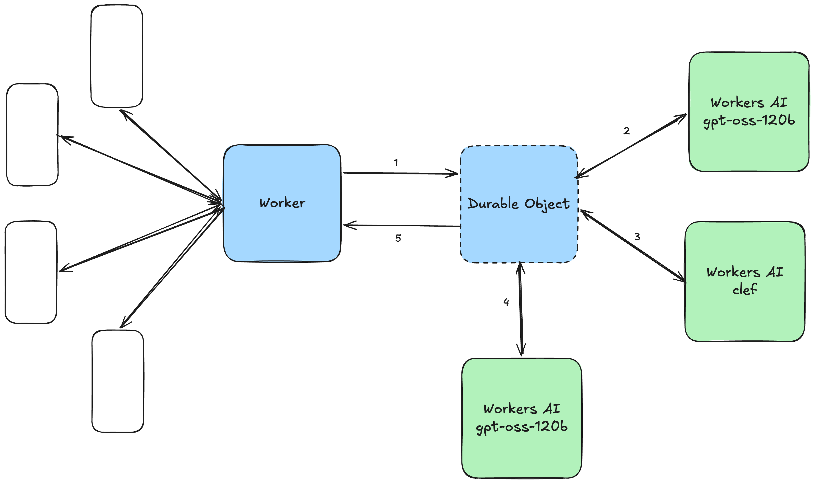

# group-taste-match

Group Taste-Match is a concept prototype of a Beli feature that helps 2–6 diners in New York City agree on **one** restaurant. A host creates a room and shares the link. Everyone says (or types) what they're in the mood for. The system asks at most one private clarification per affected diner and, only if it would help, one final question to the host. Then everyone sees the same single restaurant card.

This is an independent concept prototype. It is not an official Beli product or integration, it doesn't use Beli systems or data, and the taste profiles are synthetic.

- Live prototype: https://group-taste-match.juelzlax.workers.dev
- Product spec: [Beli_Group_Taste_Match_Explore_PRD.md](Beli_Group_Taste_Match_Explore_PRD.md)
- Experiment plan: [Beli_Group_Explore_Experiment_Plan.md](Beli_Group_Explore_Experiment_Plan.md)
- Results report: [Markdown](Beli_Group_Explore_Experiment_Report.md) · [PDF](Beli_Group_Explore_Experiment_Report.pdf)
- Decision addendum: [Beli_Group_Taste_Match_Clef_Decision_Addendum.pdf](output/pdf/Beli_Group_Taste_Match_Clef_Decision_Addendum.pdf)
- [Architecture sketch](beli-project-architecture.png) (conceptual; see the flow below for the decision steps)

## Architecture



One Cloudflare deployment serves the React + Vite client's static assets and the API. Requests to `/api/*` run the Worker, which routes each group to its own Durable Object. Each room's object has SQLite-backed storage, alarms (deadlines, transcription grace, evaluation, 24-hour expiry), and hibernatable WebSockets. The browser connects to the Worker, not directly to the Durable Object. There are no D1 or R2 bindings. AI calls from the Durable Object use Workers AI through the `group-taste-match` AI Gateway; the application bypasses gateway caching for each call.

The live flow is: host creates a room → 2–6 diners join and submit typed or spoken requests → the shared LLM interprets each request → code checks hard requirements and may ask one private clarification per affected diner → Clef scores every eligible restaurant for every diner → code chooses the highest average fit → if it could change a soft tradeoff, the host may answer one final question → code verifies the final choice and sends the same result card to everyone. WebSockets deliver room updates, with HTTP polling as a fallback. Deepgram transcribes spoken requests before interpretation.

| Concern | Where |
| --- | --- |
| Room rules (pure state machine) | `src/shared/room-machine.ts` |
| Room Durable Object + API | `src/worker/room.ts`, `src/worker/index.ts` |
| Shared interpretation (gpt-oss-120b, grounded) | `src/server/interpret*.ts`, `src/server/clarify-patch.ts` |
| Hard-constraint guard (hours, availability, budget, dietary, travel) | `src/server/feasibility.ts` |
| Clef pipeline | `src/server/methods/clef-method.ts`, `src/server/clef.ts`, `src/server/policy.ts`, `src/server/clarify.ts` |
| LLM baseline | `src/server/methods/baseline-method.ts` |
| Shared enforcement, privacy filter, result card | `src/server/decide.ts`, `src/server/privacy.ts`, `src/server/card.ts` |
| Client (Beli-style mobile web) | `src/client/` |
| Experiment harness | `src/experiment/`, `experiment/` |

Both decision methods implement the same interface and receive identical inputs. The server picks one with `DECISION_METHOD=clef|llm_baseline`; the participant UI never exposes the choice. The deployed default is Clef. It selects the eligible restaurant with the highest average diner fit, breaking exact ties by the shortest worst trip and then restaurant ID. The baseline remains available for comparison.

Models: `@cf/cloudflare/clef` (fit scoring and bounded choices), `@cf/openai/gpt-oss-120b` (interpretation, wording, and the baseline), `@cf/deepgram/nova-3` (speech-to-text), and `@cf/moonshotai/kimi-k2.6` (experiment judge only).

## Setup

Requires Node 22+, pnpm, and a Cloudflare account with Workers AI. Durable Objects with SQLite work on the free plan; the historical experiment's Kimi judge requires Workers Paid or prepaid AI Gateway credits.

```sh
pnpm install
npx wrangler login
cp .dev.vars.example .dev.vars   # edit local overrides as needed; this file is ignored
pnpm dev                          # http://localhost:5173 (any port works)
```

`.dev.vars` settings:

| Name | Values |
| --- | --- |
| `PROVIDER_MODE` | `live` calls Workers AI. `fixture` gives canned outcomes for offline UI work, steered by `#clarify`, `#host`, `#nomatch`, `#error` in a diner's text. Fixture results are never benchmark results. |
| `DECISION_METHOD` | `clef` or `llm_baseline` |
| `AI_GATEWAY_ID` | `group-taste-match` |
| `DEV_ROUTES` | Add `DEV_ROUTES=on` to `.dev.vars` for local experiment and trace routes. Never set it in deployed config. |

Commands:

```sh
pnpm test        # Vitest in the Workers runtime (@cloudflare/vitest-plugin), always fixture mode
pnpm typecheck
pnpm exec playwright install chromium webkit  # one-time browser setup
PROVIDER_MODE=fixture pnpm e2e  # Playwright: two sessions + six diners on a 360 px viewport
pnpm run deploy  # build + wrangler deploy
```

## Data and provenance

- `data/v1/restaurants.json` holds a snapshot of 30 NYC restaurants (16 Manhattan, 9 Brooklyn, 5 Queens). Facts come from official sites and menus, retrieved 2026-10-04, with field-level evidence records; coordinates come from OpenStreetMap Nominatim. Unknowns stay `null`. Atmosphere tags are evidence-backed editorial judgments. "No match" means no match in this list, not in all of NYC.
- `data/v1/profiles.json` holds 8 synthetic taste profiles, each an invented ranked history of real restaurants. They are not real Beli users or Beli data.
- `data/v1/meeting-areas.json` lists approximate neighborhood reference points.
- Availability is simulated and deterministic. It is seeded per restaurant, local date, 15-minute window, party size, and seed, and it never offers a table at a restaurant known to be closed in the snapshot. The UI labels it "Simulated availability — prototype." The app does not make reservations.
- Travel times are documented geographic estimates (haversine distance × 1.3, then a walking or subway speed range), not live transit routing.

## Privacy and retention

Raw audio is never stored. Transcripts, decision traces, and interpretation caches live in the room's Durable Object and are deleted when the room expires 24 hours after creation. This deletion applies to room storage; AI Gateway logging and retention are configured separately from the room. Shared views never show another diner's input, who was asked to clarify, or the host's question. A deterministic filter removes names, private budget amounts, starting points, and allergy details from group-facing text.

## Experiment

The exp-v1 experiment followed the plan, with 60 synthetic scenarios: 20 for development and 40 held out. The fixed-state track ran 3 repeats per method on the held-out set (240 runs), and the complete-flow track ran once per method (80 sessions). An independent deterministic checker evaluated runs against ground truth, and Kimi K2.6 gave a separate model-judged per-diner fit score. The blinded A/B review by the developer initially favored the baseline. The later offline selection-policy diagnostic and the owner's choice to develop Clef are documented in the decision addendum. Exp-v1 used Clef's earlier minimum-fit rule; its results do not measure the deployed average-fit rule. For the original experiment, use the frozen exp-v1 commit recorded in `experiment/protocol.json`.

The experiment endpoints run inside the local dev Worker, so calls use the Workers AI binding and AI Gateway and no API tokens are handled by scripts. To reproduce exp-v1, use the `codeCommit` recorded in `experiment/protocol.json` in a separate checkout; current `main` uses the later average-fit policy and will not reproduce the frozen runs. In that checkout, set `PROVIDER_MODE=live` and `DEV_ROUTES=on` in `.dev.vars`, then start `pnpm dev --port 5199 --strictPort` (the experiment scripts default to port 5199). Run the scripts in a second terminal:

```sh
pnpm exp:labels                               # truth labels + dataset manifest (no model calls)
pnpm exp:freeze --split=test                  # fixed-state inputs
pnpm exp:run --split=test --track=fixed --repeats=3
pnpm exp:run --split=test --track=flow
pnpm exp:judge --split=test                   # kimi-k2.6, model-judged
pnpm exp:analyze --split=test                 # metrics.csv, summary.json
pnpm exp:packet && pnpm review                # blinded A/B review at http://localhost:5300
pnpm exp:human                                # unblind responses after review
pnpm exp:charts                               # regenerate figures from analyzed results
pnpm exp:pdf                                  # render the existing report Markdown to PDF
```

Outputs: `experiment/protocol.json`, `experiment/dataset_manifest.json`, `experiment/results/runs.jsonl`, `experiment/results/metrics.csv`, and `experiment/review/blinded_review_packet.md`.
